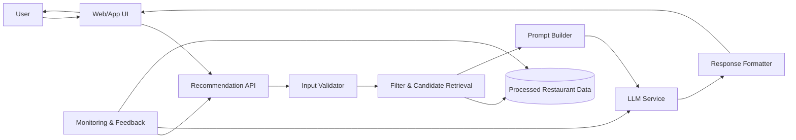
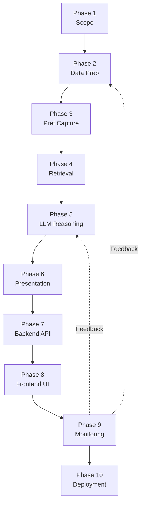
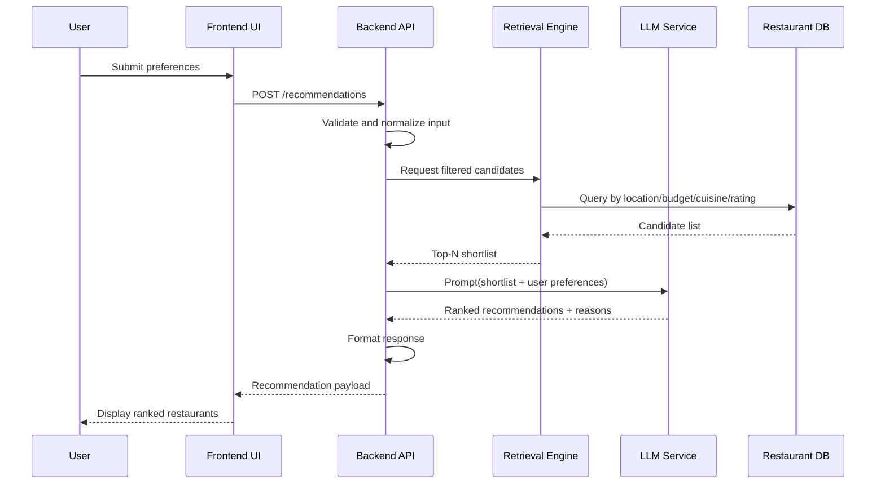

# Phase-Wise Architecture  
**Project:** AI-Powered Restaurant Recommendation System (Zomato Use Case)

This document defines the end-to-end architecture in phases, from data preparation to production deployment, with visual diagrams for implementation clarity.

## 1. Phase Breakdown

### Phase 1: Requirements and Scope Definition
**Goal:** Finalize what the system must do in MVP.

**Key Tasks**
- Define user inputs (location, budget, cuisine, rating, optional preferences)
- Define output format (ranked list + explanation)
- Set quality targets (relevance, latency, reliability)

**Deliverable**
- Finalized MVP requirement document

---

### Phase 2: Data Ingestion and Preparation
**Goal:** Build a clean and consistent restaurant dataset.

**Key Tasks**
- Ingest Zomato data from Hugging Face
- Remove duplicates and handle missing values
- Normalize fields (city, cuisine labels, budget categories, ratings)
- Store clean data for fast querying

**Deliverable**
- Processed dataset for retrieval and filtering

---

### Phase 3: User Preference Capture Layer
**Goal:** Convert user intent into structured query input.

**Key Tasks**
- Build form/API for preference input
- Validate entries (city values, rating ranges, budget types)
- Convert raw input into normalized request object

**Deliverable**
- Structured preference payload

---

### Phase 4: Candidate Retrieval Layer
**Goal:** Select relevant restaurant candidates before LLM reasoning.

**Key Tasks**
- Apply hard filters (location, cuisine, budget, minimum rating)
- Score candidates with simple ranking heuristics
- Select top N records for LLM analysis

**Deliverable**
- High-quality shortlisted candidates

---

### Phase 5: LLM Recommendation Layer
**Goal:** Generate personalized and explainable recommendations.

**Key Tasks**
- Build prompt template with user preferences + shortlisted data
- Ask LLM to rank and explain recommendations
- Enforce output structure for UI/API consistency
- Add fallback logic for malformed model responses

**Deliverable**
- Ranked recommendations with explanations

---

### Phase 6: Response Presentation Layer
**Goal:** Display recommendations in a user-friendly format.

**Key Tasks**
- Render results as cards/list/table
- Show name, cuisine, rating, cost, explanation
- Support optional sorting/refinement actions

**Deliverable**
- Final user-facing recommendation output

---

### Phase 7: Backend API Implementation
**Goal:** Transition from offline scripts to a real-time API service.

**Key Tasks**
- Develop a RESTful API using **FastAPI**
- Create `/recommend` endpoint that orchestrates Phase 3, 4, and 5
- Add API documentation using Swagger (OpenAPI)
- Implement error handling and rate limiting

**Deliverable**
- Functional Backend API service

---

### Phase 8: Frontend Web Application
**Goal:** Provide an interactive and stunning user interface.

**Key Tasks**
- Build a responsive web application (Vanilla JS or React)
- Implement preference capture forms (Location search, Budget toggles)
- Integrate dynamic results rendering (based on Phase 6 designs)
- Add interactive maps or "More Details" views for restaurants

**Deliverable**
- Interactive Web Frontend

---

### Phase 9: Monitoring and Continuous Improvement
**Goal:** Track performance and improve quality.

**Key Tasks**
- Log API latency and LLM success rates
- Store user feedback (thumbs up/down)
- A/B test prompt variations
- Periodically update the dataset from source

**Deliverable**
- Optimization dashboard and feedback data

---

### Phase 10: Deployment and Scale
**Goal:** Run the system in a production environment.

**Key Tasks**
- Containerize both Backend and Frontend using Docker
- Deploy to a cloud provider (AWS/GCP/Vercel)
- Set up automated CI/CD pipelines
- Enable monitoring alerts and scaling policies

**Deliverable**
- Live Production Environment

## 2. High-Level Architecture Diagram

## 3. Phase-to-Layer Mapping Diagram

## 4. Recommendation Request Sequence Diagram

## 5. Implementation Notes

- Keep retrieval deterministic; use the LLM for reasoning and explanation.
- Limit the number of candidates sent to the LLM to control latency and cost.
- Use structured outputs (JSON schema) to improve response reliability.
- Add fallback behavior (retrieval-only ranking) when LLM calls fail.
